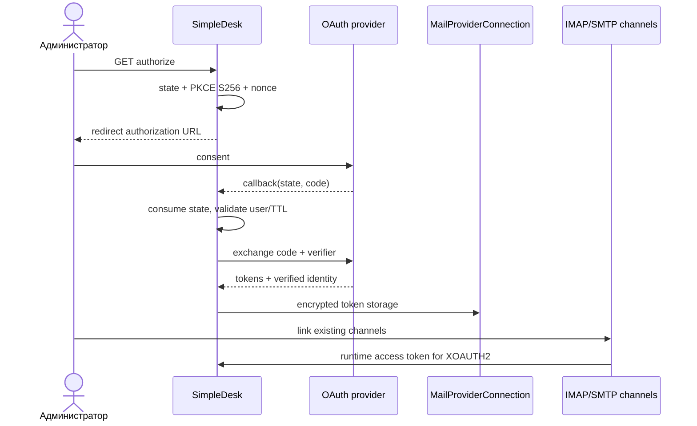

# OAuth Integrations

## Назначение и сущности

OAuth Integrations подключает Google или Microsoft mailbox account к существующим IMAP/SMTP-каналам. `MailProviderConnection` — приложение, identity, encrypted tokens и общий health; `MailboxChannel` — конкретный транспорт. Связь задаётся `mailbox_channels.provider_connection_id`, а канал использует `auth_type=oauth2`.

Таблица `mail_provider_connections` хранит публичные `configuration`, `account_identifier`, `tenant_identifier`, `scopes`, `token_expires_at`, `connected_at`, `last_refreshed_at`, health/error timestamps и encrypted `secret_configuration`. Resource отдаёт `connected_email` из `account_identifier`, но не secrets.

## Сценарий администратора

1. Создать integration: имя, `google|microsoft`, `client_id`, `client_secret`, active; для Microsoft — `tenant_mode` и при `specific` `tenant_id`.
2. Включить integration и открыть `authorize`. `MailOAuthStateService` создаст state/PKCE/nonce и перенаправит browser.
3. Callback одноразово потребит flow, обменяет code через provider и сохранит токены `MailOAuthTokenService::storeTokens()`.
4. В существующих incoming/outgoing channels выбрать `oauth2` и эту provider connection. Username берётся из channel settings или `account_identifier`.
5. Test использует `MailOAuthConnectionTestController` и `MailProviderConnectionTester`. Disconnect пытается revoke, затем всегда очищает локальные токены/identity и выключает OAuth channels.

Soft delete выключает integration и OAuth channels. Restore оставляет `is_active=false`. Force delete запрещён, пока существуют связанные channels.

## Изменение конфигурации

`MailOAuthIntegrationRequest` и `MailOAuthIntegrationService` реализуют следующие правила:

| Изменение | Client secret | Токены и каналы |
|---|---|---|
| Только name/active | пустое поле сохраняет прежний secret | tokens сохраняются |
| `client_secret` | непустое значение заменяет secret | tokens сохраняются, если остальная OAuth-конфигурация прежняя |
| `provider` или `client_id` | новый secret обязателен | access/refresh token, identity и timestamps очищаются; OAuth channels выключаются |
| `tenant_mode` или `tenant_identifier` | существующий secret допустим | tokens/identity очищаются; OAuth channels выключаются |

Google очищает tenant fields. Microsoft `common`/`organizations` очищают `tenant_id`; `specific` требует его.

## Permissions и маршруты

| Действие | Permission |
|---|---|
| index/edit view | `admin.mail.view_oauth_integrations` или `admin.mail.manage_oauth_integrations` |
| create/store/update/delete/restore/force | `admin.mail.manage_oauth_integrations` |
| authorize/callback/refresh/disconnect | `admin.mail.connect_oauth_accounts` или manage |
| test | `admin.mail.test_connections` |

Префикс route names: `admin.email.oauth-integrations.`. Доступны `index`, `create`, `store`, `edit`, `update`, `destroy`, `restore`, `force-destroy`, `authorize`, `callback`, `refresh`, `test`, `disconnect`; URI — `/admin/email/oauth-integrations` и соответствующие suffixes из `routes/web.php`.

Контроллеры: `MailOAuthIntegrationController`, `MailOAuthAuthorizationController`, `MailOAuthCallbackController`, `MailOAuthRefreshController`, `MailOAuthConnectionTestController`, `MailOAuthDisconnectController`. Сервисы: `MailOAuthIntegrationService`, `MailOAuthStateService`, `MailOAuthTokenService`, `MailOAuthProviderRegistry`.

Текущий UI показывает `Not Configured`, `Ready to Connect`, `Connected`, `Reauthorization Required`, `Disabled` и `Deleted`. Badge вычисляется из deleted/active, наличия client secret и token, а также `health_status=failed`; `token_expires_at` отображается отдельно, но отдельного статуса `Token Expiring` в актуальном компоненте нет.

Mutation routes аудируются событиями `oauth_integration_created`, `oauth_integration_updated`, `oauth_authorization_started`, `oauth_account_connected`, `oauth_token_refreshed`, `oauth_connection_tested`, `oauth_account_disconnected`, `oauth_integration_deleted`, `oauth_integration_restored`, `oauth_integration_force_deleted` и `oauth_authorization_failed` из `MailAdminAuditEvent`.
