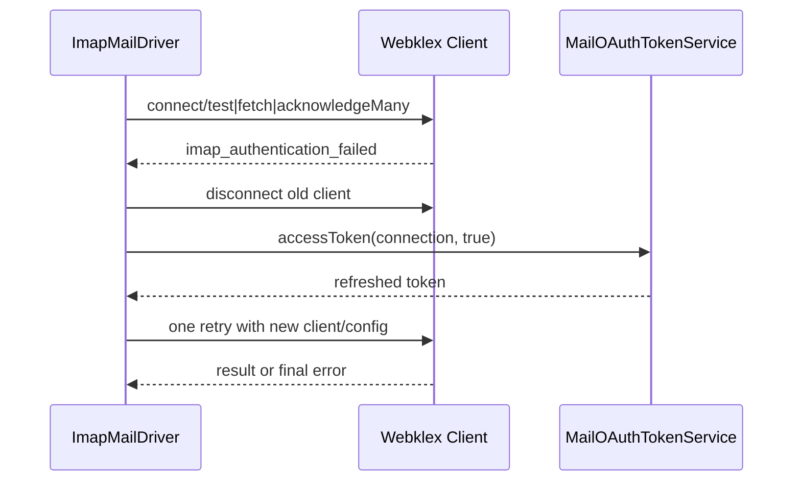
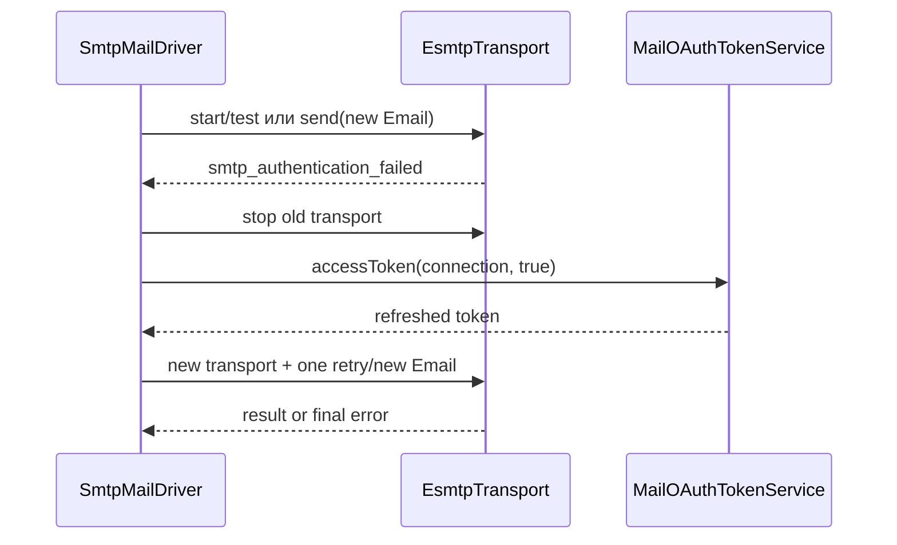

# OAuth в IMAP и SMTP

## Общий принцип

`MailboxChannel` с `auth_type=oauth2` ссылается на `MailProviderConnection`. `ImapChannelConfigurationFactory` и `SmtpChannelConfigurationFactory` выбирают username из channel secret/configuration либо `account_identifier`, а password runtime DTO заменяют текущим access token из `MailOAuthTokenService`. Сам token в конфигурацию канала не сохраняется.

## IMAP / Webklex PHP-IMAP

`ImapClientFactory` получает `ImapChannelConfigurationData`; для OAuth Webklex configuration использует `authentication=oauth`. `ImapMailDriver::test()`, `fetch()` и `acknowledgeMany()` обрабатывают ошибку, которую `ImapExceptionMapper` классифицировал как `imap_authentication_failed`.

Только для OAuth и только один раз driver отключает старый client, вызывает `ImapChannelConfigurationFactory::refreshOAuthToken()` с forced refresh и рекурсивно повторяет операцию с `oauthRetried=true`. Вторая authentication failure возвращается наружу; третьей попытки нет. `Password` auth не запускает OAuth refresh. `acknowledge()` делегирует пакетной операции.

## SMTP / Symfony Mailer

`SmtpTransportFactory` создаёт `EsmtpTransport`; при OAuth устанавливает только `Symfony\Component\Mailer\Transport\Smtp\Auth\XOAuth2Authenticator`. `SmtpEncryption` управляет implicit TLS (`smtps`) или STARTTLS; factory дополнительно проверяет установленное TLS-соединение.

`SmtpMailDriver::test()` и `send()` повторяют только `smtp_authentication_failed`. После первой ошибки transport закрывается в `finally`, выполняется forced refresh, затем создаются новая runtime configuration и новый transport. При повторной отправке `SymfonyEmailFactory` заново создаёт `Email`, поэтому не переиспользуется уже отправленный message object. Вторая ошибка окончательная; Password auth не refresh-ится.

Все операции сохраняют существующий health/failover pipeline: драйверные исключения остаются `MailDriverException`, а connection tests проходят через `MailChannelHealthRecorder`.

