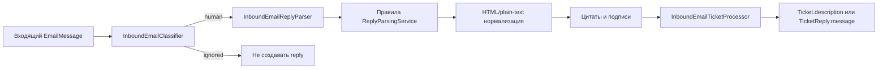

# Reply Parsing

## Назначение

Reply Parsing оставляет новый полезный ответ и удаляет цитируемую переписку/подпись до записи обращения. Модуль работает только с входящими `EmailMessage`, которые `InboundEmailClassifier` признал пользовательскими; автоответы, delivery status, bulk, сообщения от того же ящика и сообщения с `X-SimpleDesk-Origin` могут исключаться настройками `config/simpledesk-mail-reply-parsing.php`.

## Поток обработки



`InboundEmailReplyParser` выбирает plain text, если `prefer_plain_text=true`, иначе HTML; применяет активные неудалённые `ReplyParsingRule`, затем преобразует HTML в текст и выполняет встроенные эвристики. `ReplyParsingService` выбирает самое раннее совпадение среди правил, отсортированных по `display_order`, затем `id`; при одинаковом offset приоритет сохраняет этот порядок. `literal` экранируется через `preg_quote`, а `regex` хранится как тело PCRE без внешних delimiters и компилируется `ReplyParsingPatternCompiler` с модификатором `u`.

HTML обрабатывается `DOMDocument` с `LIBXML_NONET`: удаляются небезопасные/служебные узлы и известные quote-контейнеры (`blockquote`, Gmail/Yahoo/Mozilla/Outlook markers). При ошибке DOM используется текстовый fallback. Plain text распознаёт стандартные Original/Forwarded Message, локализованные `On … wrote`, Outlook-заголовки и хвостовые строки `>`. Подписи удаляются только в последних 12 строках по разделителю `--` и известным mobile signatures.

## Fallback и ограничения

- Ошибка пользовательского regex не уничтожает исходный текст: ошибка репортится, обработка продолжается с оригиналом.
- Пустой результат заменяется `empty_body_fallback`, либо полным телом при `fallback_to_full_body=true`.
- `max_body_characters` ограничивает итог с маркером сокращения.
- HTML sanitization не является обязанностью `ReplyParsingService`; HTML всё равно преобразуется в текст в inbound parser.
- Эвристики могут ошибиться на естественном тексте, похожем на заголовок цитаты; используйте Preview маршрута `admin.email.reply-parsing.preview`.

При создании нового ticket результат попадает в `Ticket.description`, при совпадении thread — в `TicketReply.message`; метаданные сохраняются под `ticketing.reply_parsing`.

## Основные классы и тесты

Классы: `ReplyParsingService`, `ReplyParsingRuleQuery`, `ReplyParsingPatternCompiler`, `InboundEmailReplyParser`, `InboundEmailClassifier`, `InboundEmailTicketProcessor`; модель — `App\Models\Admin\Mail\ReplyParsingRule`, таблица — `mail_reply_parsing_rules`.

```bash
php artisan test tests/Unit/Admin/Mail/ReplyParsing/ReplyParsingServiceTest.php
php artisan test tests/Feature/Admin/Mail/ReplyParsing
php artisan test tests/Feature/Admin/Mail/Ticketing/InboundEmailTicketProcessorTest.php
```

